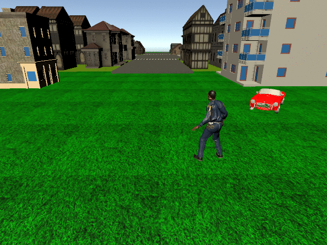

# Synthetic-Dataset-generation-with-Unity

Unity is a very interesting tool for dataset generation, allowing us to achieve new data for training every machine learning techniques when there is a shortage of these.

Furthermore this is useful to generate specific data in very short times, according with the current AI task we are performing.

## Internal architecture
Project
Assest
...

TODO

## How it works
Randomized Scenario --> RUN

Frame...

TODO

## Specific case:

# man down detection vs standing people

- People and fbx models
- Results

--> STANDING PEOPLE: Camera 0

--> MAN DOWN: Camera 0

